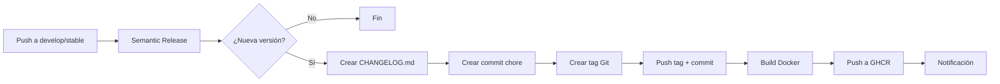

# 🚀 Release Workflow - KeeperCheky

## Descripción General

KeeperCheky utiliza un **workflow unificado** inspirado en [Jellyseerr](https://github.com/seerr-team/seerr), que combina semantic-release y construcción de imágenes Docker en un solo pipeline.

## 🔄 Flujo del Proceso



## 📋 Workflow Unificado

KeeperCheky utiliza **3 workflows principales** para gestionar CI/CD:

### 1. CI Workflow (`.github/workflows/ci.yml`)

**Propósito**: Validaciones rápidas para Pull Requests y pushes a ramas

**Se ejecuta en:**
- Pull Requests a `develop` o `stable`
- Pushes a `develop` o `stable`

**Jobs en paralelo:**

1. **Lint**: Verifica formato de código
   - `go fmt -s -l .` (formato)
   - `go vet ./...` (análisis estático)

2. **Test**: Ejecuta pruebas unitarias
   - `go test -v -race -coverprofile=coverage.out ./...`
   - Sube coverage a Codecov (opcional)

3. **Build**: Compila el binario
   - `CGO_ENABLED=1 go build -o bin/keepercheky ./cmd/server`
   - Verifica que la compilación sea exitosa

4. **Docker Build Check**: Valida Dockerfile
   - Build de prueba solo para `linux/amd64`
   - **No hace push** de la imagen
   - Usa cache de GitHub Actions

**Beneficios:**
- ✅ Feedback rápido en PRs (2-5 minutos)
- ✅ No construye imágenes Docker completas (ahorro de recursos)
- ✅ Validación de código antes de merge
- ✅ Cancel-in-progress habilitado (cancela builds antiguos)

### 2. Release Workflow (`.github/workflows/release.yml`)

**Propósito**: Gestionar releases automáticos y construcción de imágenes

### Archivo: `.github/workflows/release.yml`

El workflow se activa en:
- Push a `develop` → genera versiones `1.0.0-dev.X`
- Push a `stable` → genera versiones `1.0.0`

### Jobs:

#### 1. **semantic-release**
- Analiza commits convencionales
- Determina nueva versión (si aplica)
- Genera `CHANGELOG.md` actualizado
- Crea commit `chore(release): X.Y.Z`
- Crea tag Git `vX.Y.Z`
- Publica GitHub Release
- **Outputs:**
  - `new_release_published`: `true`/`false`
  - `new_release_version`: `1.0.0-dev.1`
  - `new_release_git_tag`: `v1.0.0-dev.1`

#### 2. **build-and-push**
- **Condición:** Solo si `new_release_published == 'true'`
- Checkout del código en el tag exacto creado
- Construcción multi-arquitectura (`linux/amd64`, `linux/arm64`)
- Push a GitHub Container Registry
- **Tags generados:**
  - Para versión `1.0.0-dev.1`:
    - `ghcr.io/carcheky/keepercheky:1.0.0-dev.1`
    - `ghcr.io/carcheky/keepercheky:develop`
  - Para versión `1.0.0`:
    - `ghcr.io/carcheky/keepercheky:1.0.0`
    - `ghcr.io/carcheky/keepercheky:1.0`
    - `ghcr.io/carcheky/keepercheky:1`
    - `ghcr.io/carcheky/keepercheky:latest`
    - `ghcr.io/carcheky/keepercheky:stable`

#### 3. **notify**
- Siempre se ejecuta (incluso si fallan pasos anteriores)
- Genera resumen del workflow
- Estado de cada job

### 3. Docker Build Workflow (`.github/workflows/docker-build.yml`)

**Propósito**: Construcción directa de imágenes Docker desde tags

**Se ejecuta en:**
- Push de tags que coincidan con `v*` (ej: `v1.0.0`, `v2.1.0-dev.3`)

**Jobs:**

1. **build-and-push**: Construye y publica imagen
   - Checkout del código en el tag
   - Construcción multi-arquitectura (`linux/amd64`, `linux/arm64`)
   - Push automático a GitHub Container Registry
   - Tags generados según el tipo de versión

**Uso típico:**
- Reconstruir imagen de una versión específica
- Publicar manualmente un tag existente
- Generalmente **no se usa manualmente** porque `release.yml` ya construye imágenes

**Nota:** Este workflow es complementario a `release.yml`. En flujo normal, las imágenes se construyen vía `release.yml`.


## 🏷️ Estrategia de Tags

### Rama `develop` (pre-release)
```
Versión: 1.0.0-dev.1
Tags Docker:
  - 1.0.0-dev.1
  - develop
```

### Rama `stable` (producción)
```
Versión: 1.0.0
Tags Docker:
  - 1.0.0
  - 1.0
  - 1
  - latest
  - stable
```

## 📝 Commits Convencionales

El workflow usa [Conventional Commits](https://www.conventionalcommits.org/):

| Tipo       | Release | Descripción                  |
|------------|---------|------------------------------|
| `feat`     | minor   | Nueva funcionalidad          |
| `fix`      | patch   | Corrección de bug            |
| `perf`     | patch   | Mejora de rendimiento        |
| `refactor` | patch   | Refactorización de código    |
| `docs`     | -       | Documentación                |
| `chore`    | -       | Mantenimiento                |
| `test`     | -       | Tests                        |
| `BREAKING` | major   | Cambio incompatible          |

### Ejemplos:

```bash
# Nueva funcionalidad (minor: 1.0.0 → 1.1.0)
git commit -m "feat(sync): add intelligent torrent matching"

# Corrección de bug (patch: 1.0.0 → 1.0.1)
git commit -m "fix(ui): resolve mobile tooltip display"

# Breaking change (major: 1.0.0 → 2.0.0)
git commit -m "feat(api)!: redesign configuration structure

BREAKING CHANGE: Config file format changed from YAML to TOML"
```

## 🔧 Configuración

### `.releaserc.json`

```json
{
  "branches": [
    { "name": "stable" },
    { "name": "develop", "prerelease": "dev" }
  ],
  "plugins": [
    "@semantic-release/commit-analyzer",
    "@semantic-release/release-notes-generator",
    "@semantic-release/changelog",
    "@semantic-release/git",
    "@semantic-release/github"
  ]
}
```

### Secrets necesarios

- `GITHUB_TOKEN`: Automático (GitHub Actions)
- `PAT_TOKEN`: Personal Access Token (opcional, para bypass de protecciones)

## 🎯 Ventajas del Workflow Unificado

### ✅ Resuelve problemas anteriores:

1. **Tag triggering inconsistente**: Ya no hay workflows separados
2. **CHANGELOG desactualizado en Docker**: La imagen siempre contiene el changelog correcto
3. **Race conditions**: Todo es secuencial en un solo workflow
4. **Complejidad**: Un solo archivo vs. múltiples workflows coordinados

### ✅ Beneficios adicionales:

- Construcción solo cuando hay nueva versión (ahorra recursos)
- Workflow más fácil de entender y mantener
- Resumen automático del proceso
- Notificaciones consistentes
- Inspirado en proyectos maduros (Jellyseerr)

## 🧪 Cómo Probar

### Escenario 1: Feature en develop
```bash
git checkout develop
git pull
echo "test" > test.txt
git add test.txt
git commit -m "feat(test): add test feature"
git push origin develop
```

**Resultado esperado:**
- Nueva versión: `1.0.0-dev.1` (o siguiente)
- Tag creado: `v1.0.0-dev.1`
- Docker image: `ghcr.io/carcheky/keepercheky:1.0.0-dev.1` + `develop`

### Escenario 2: Fix en develop
```bash
git commit -m "fix(test): correct test issue"
git push origin develop
```

**Resultado esperado:**
- Nueva versión: `1.0.0-dev.2` (incremento de prerelease)
- Docker image: `ghcr.io/carcheky/keepercheky:1.0.0-dev.2` + `develop`

### Escenario 3: Docs (sin release)
```bash
git commit -m "docs: update README"
git push origin develop
```

**Resultado esperado:**
- **No se genera nueva versión**
- No se construye imagen Docker
- Workflow termina en semantic-release job

## 📊 Monitoreo

### Ver workflow en ejecución:
```
https://github.com/carcheky/keepercheky/actions
```

### Ver releases:
```
https://github.com/carcheky/keepercheky/releases
```

### Ver imágenes Docker:
```
https://github.com/carcheky/keepercheky/pkgs/container/keepercheky
```

## 🐛 Troubleshooting

### El workflow no se ejecuta
- Verificar que el commit no sea `chore(release):` (filtro automático)
- Verificar permisos del token PAT_TOKEN

### No se crea nueva versión
- Verificar que el commit siga Conventional Commits
- Commits tipo `docs`, `chore`, `test` no generan releases

### Docker build falla
- Verificar logs del job `build-and-push`
- Verificar que el Dockerfile sea correcto
- Verificar que GITHUB_TOKEN tenga permisos de packages

### Tag no se crea
- Verificar configuración de `.releaserc.json`
- Verificar que semantic-release se ejecute correctamente

## 📚 Referencias

- [Conventional Commits](https://www.conventionalcommits.org/)
- [Semantic Release](https://semantic-release.gitbook.io/)
- [Jellyseerr Workflow](https://github.com/seerr-team/seerr/blob/develop/.github/workflows/release.yml)
- [Docker Metadata Action](https://github.com/docker/metadata-action)

## 🔄 Migración desde Workflows Antiguos

Los workflows fueron reorganizados para optimizar CI/CD:

### Workflows Actuales (Octubre 2025)

1. **`release.yml`**: Gestiona releases automáticos con semantic-release
   - Se ejecuta en push a `develop` y `stable`
   - Genera versiones, tags y CHANGELOG
   - Construye y publica imágenes Docker cuando hay nueva versión

2. **`docker-build.yml`**: Construcción directa de Docker (solo tags)
   - Se ejecuta cuando se crea un tag manualmente (`v*`)
   - Útil para reconstruir imágenes de versiones específicas
   - Push directo a GHCR

3. **`ci.yml`**: Validaciones para Pull Requests
   - Linting (go fmt, go vet)
   - Tests unitarios con coverage
   - Build check del binario
   - Docker build check (sin push)
   - Se ejecuta en PRs y pushes a ramas principales

### Workflows Antiguos (Renombrados)

Estos workflows están disponibles como referencia pero **no se ejecutarán**:
- `semantic-release.yml.old`
- `docker-build.yml.old`

---

**Última actualización:** 2025-11-01
**Versión workflow:** 2.0.0
